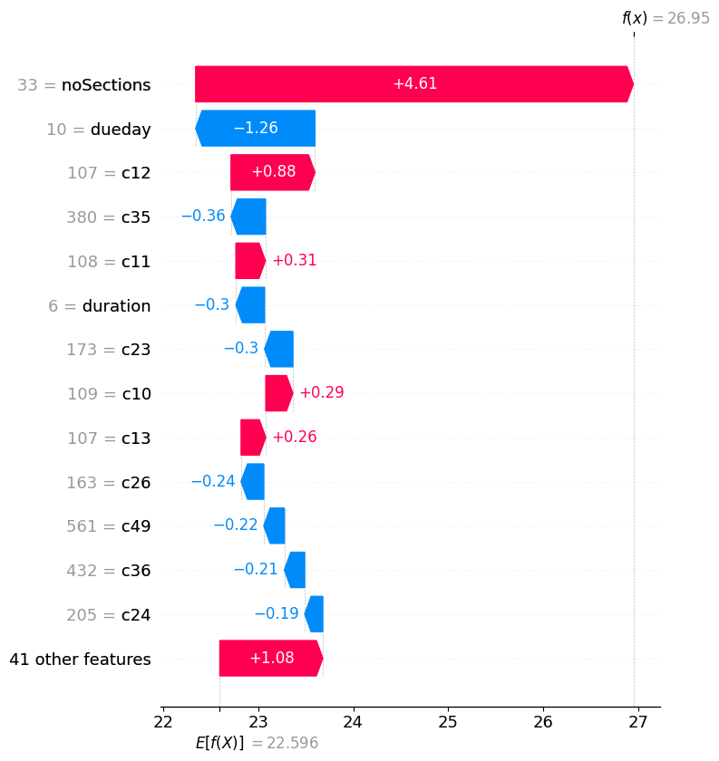

[](https://pubsonline.informs.org/journal/ijoc)

# A prediction-based approach for online dynamic appointment scheduling: a case study in radiotherapy treatment

This archive is distributed in association with the [INFORMS Journal on Computing](https://pubsonline.informs.org/journal/ijoc) under the [MIT License](LICENSE).

The software and data in this repository are a snapshot of the software and data that were used in the research reported on in the paper 
"A prediction-based approach for online dynamic appointment scheduling: a case study in radiotherapy treatment". 
The snapshot is based on 
[this SHA](https://github.com/ge660/2021.0342/commit/4a3c4dd0250a9d85357be851560a776e5b3aad76)
in the development repository.


The paper proposed a machine learning-based approach to solve an online appointment scheduling in which patients with varying priority levels arrive dynamically over a rolling horizon. Thies approach was demonstrated through a case study of a radiotherapy scheduling problem for cancer patients, which involves patients of different priorities, multiple appointments, and uncertainty in arrival times. 
The approach also supports explainability in decision-making. 

## Cite

[](https://zenodo.org/badge/latestdoi/588879725)

Below is the BibTex for citing this software.

```
@article{Pham23,
  author =        {Pham, T. S., Legrain, A., De Causmaecker, P., & Rousseau, L. M. },
  publisher =     {INFORMS Journal on Computing},
  title =         {A prediction-based approach for online dynamic appointment scheduling: a case study in radiotherapy treatment},
  year =          {2023},
}  
```
## Description

The goal of this software is to schedule radiotherapy treatment for cancer treatments using a prediction-based approach. 
<!-- The repository is organized following the tree structure below: 

```bash
.
├── data
│   ├── lambda5.0
│   │  ├── data (data instances)
│   │  └── output
│   │      ├── prediction   (raw testing/training csv files and the trained regression model)
│   │      └── results      (detailed results of all data instances)
│   └── lambda6.0
│      ├── ...
├── results				(raw results and figures)
├── script				(scripts) 
└── src					(source code)
```

- Directory `./data` consists of all data instances and raw results, organized by instance settings. Consult the README file inside the `./data` directory for more details.
- Directory `./results` consists of all figures and raw results (csv files) from the paper. Raw results of each instance setting can also be found in `./data` directory. 
- Directory `./script` consists of all necessary bash script files to replicate the results.
- Directory `./src` consists of the implementation of the algorithms. -->

## Building

In Linux, use the following script to install the virtual environment. Python3.8 is required. 
```shell
python3.8 -m venv .venv
source .venv/bin/activate
pip3 install -r requirements.txt
```

To install CPLEX, please obtain a licensed version, follow the installation instruction of [CPLEX](https://www.ibm.com/support/pages/installation-ibm-ilog-cplex-optimization-studio-linux-platforms) and then set up [the Python API of CPLEX](https://www.ibm.com/docs/en/icos/20.1.0?topic=cplex-setting-up-python-api).

## Results

To replicate the results, navigate to the `./scripts` directory and execute the corresponding script file. 
The output generated from the script will be saved in the `./scripts/output` directory. 

### Tuning reservation rate (Section 4.3)
Figure 5  in the paper shows the results of parameter tuning. 
  

To replicate Figure 5, execute the following script: 

```shell
cd script
bash tuning.sh
```
To replicate the experiment, change the line `rerun=0` into `rerun=1`.
The results will be saved to `./script/output/tuning`

### Capacity simulation 
Figures 6, 9, and 19 in the paper show the results of capacity simulation for 4, 6, and 8 linacs. 
  
  
  
To reproduce figures 6, 9, and 19 in the paper regarding capacity simulation, execute the following script:

```shell
cd script
bash capacity_sim.sh
```

The script replicate the capacity simulation for 3 instant settings: 4, 6 and 8 linacs. 
The results will be saved in `./script/output`

### Batch simulation
Figures 7, 8, 10, 11, 13 show the results of different strateging policies on different instant settings. 

  
To regenerate Figure 7, execute the following script:
```shell
cd script
bash simulation_batch.sh 4 5.0
```

  
To regenerate Figure 7, execute the following script:
```shell
cd script
bash simulation_batch.sh 4 6.0
```

  
To regenerate Figure 10, execute the following script:
```shell
cd script
bash simulation_batch.sh 9 10.0
```

  
To regenerate Figure 11, execute the following script:
```shell
cd script
bash simulation_batch.sh 9 12.0
```

  
To regenerate Figure 13, execute the following script:
```shell
cd script
bash simulation_batch.sh 7 10.1
```


  
To regenerate Figure 20, execute the following script:
```shell
cd script
bash simulation_batch.sh 6 7.0
```

  
To regenerate Figure 21, execute the following script:
```shell
cd script
bash simulation_batch.sh 6 9.0
```

The results (a csv file and a boxplot of the results) will be saved in a proper sub-directory in `./script/output`, depending on the instant setting.

### Model training

To train regression models and replicate Table 5, 6, 7, execute the following script with a proper instant setting:

```shell
cd script
bash train_model.sh
```

## Patient flow's plot
Figure 12 shows the real patient flow. 
  
To regenerate Figure 12, execute the following script:

```shell
cd script
bash plot_real_pf.sh
```

## Real instance
Figure 14 shows the results on the real instance.
   
To replicate the results (Figure 14 and Table 4) using our raw results, execute the following script:

```shell
cd script
bash real_ins.sh
```

To replicate the experiment and plot the new results, change the line `rerun=0` to `rerun=1`.
The results will be saved to directory `./script/output/real_ins`


## SHAP's plots
Figures 15, 16, 17 are SHAP plots that assist explainability in scheduling decisions. 

  
  


To reproduce figures 15, 16, 17, use the following script:

```shell
cd script
bash shap.sh
```
